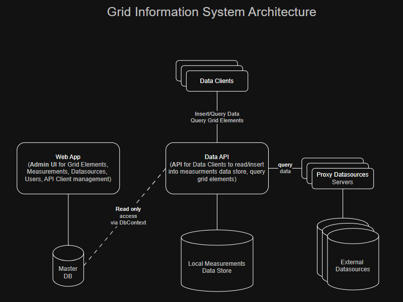
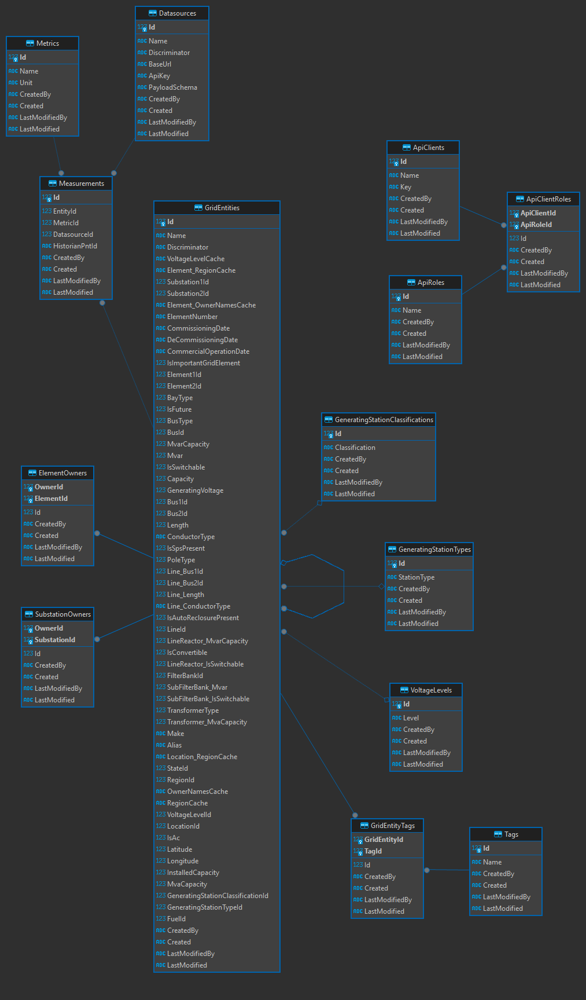

Grid Elements database service for managing and querying Grid Elements database

## System Architecture


## Status
### Defined Element Entities
* Element
* Bay
* Bus 
* BusReactor
* FilterBank 
* GeneratingUnit 
* HvdcLine 
* HvdcPole 
* Line 
* LineReactor 
* SubFilterBank 
* Transformer


### Pending Element Entities to be defined
* SVC
* FSC
* Compensator

### Implemented General Entities
* ElementOwner
* Fuel
* GeneratingStation
* GeneratingStationClassification
* GeneratingStationType
* Location
* Owner
* Region
* State
* Substation
* SubstationOwner
* VoltageLevel

### Implemented Entity Management UIs
* Buses
* Lines
* Locations
* Owners
* Regions
* States
* Substations
* VoltageLevels
* Bay
* Transformer
* Generating Unit
* GeneratingStationType
* Generating Station Classification
* Fuel
* Generating Station
* LineReactor
* BusReactor
* HvdcLine
* HvdcPole
* Filter Bank
* SubFilterBank
* Datasource
* ProxyDatasource
* Metric
* Measurement
* API Clients
* API Roles

## Name cache update domain events implementation progress
* Substation - done for voltage and location events
* Bus - done for substation name change event
* Bus Reactor - done for substation name change event
* Line - done for voltage event, location event
* Line Reactor
* Transformer
* update region cache of elements in a state when a state's region changes

## Cached properties in entities
* Generating Station - OwnerNamesCache, RegionCache
* Substation - Name (VoltageLevel.Level[done], Location.Name[done]), OwnerNamesCache, RegionCache (different for Line and HVDC Line)
* Element - VoltageLevelCache (VoltageLevel.Level[done]), RegionCache, OwnerNamesCache
* Bay - Name (BayType, Element1.Name[done], Element2.Name[done])
* Bus - Name (Substation.Name[done], BusType, ElementNumber)
* BusReactor - Name (Substation.Name[done], ElementNumber)
* FilterBank - Name (Substation.Name[done], ElementNumber)
* GeneratingUnit - Name (Substation.Name[done], ElementNumber)
* HvdcLine - Name (VoltageLevel.Level[done], Substation1.Name[done], Substation2.Name[done], ElementNumber)
* HvdcPole - Name (Substation.Name, ElementNumber)
* Line - Name (VoltageLevel.Level, Substation1.Name, Substation2.Name, ElementNumber)
* LineReactor - Name (Line.Name, Substation.Name, ElementNumber)
* SubFilterBank - Name (Substation.Name, Filterbank Number, subFilterbankTag)
* Transformer - Name (Substation1.Voltage.Level, Substation2.Voltage.Level, Substation1.Location.Name, TransformerType, ElementNumber)
* Events to be triggered for name update - VoltageLevel.Level, Location.Name, Element1.Name, Element2.Name, Substation.Name, Line.Name
* Events to be triggered for region update - State.RegionId, Location.StateId, Substation.LocationId

## Database schema


## TODOs
* List out all the cached columns of all entities and implement domain events to update them
* GridEntity tag db schema and domain layer done, app layer pending
* Restrict on delete in all many-to-many relations
* Create DB trigger type of notification when an element changes so that policies can be checked and caches can be updated with in a transaction.
For example, if a substation name changes, a notification can be issued to update all related elements names with in a trasaction so that atomicity can be implemented.
* restrict substations changes in lines when there are connected elements like line reactors
* Define control area and attach it to element
* Model MSC, MSR, TCSC, STATCOM instead of compensator
* Model SVC, FSC
* whitelisted characters in names implementation during create and update commands
* lat long value object implementation
* lat long to be made optional

## How to handle domain events
* All base entities have domain events (`List<BaseEvent> _domainEvents`) that can be dispatched while saving the entity changes
* Multiple Events are defined that are derived from BaseEvent ([example](https://github.com/jasontaylordev/CleanArchitecture/blob/b46a41b20059316e897b9a77aa277be7d42cb974/src/Domain/Events/TodoItemCreatedEvent.cs#L4)). These events can be dispatched from the mediatr command handlers ([example](https://github.com/jasontaylordev/CleanArchitecture/blob/b46a41b20059316e897b9a77aa277be7d42cb974/src/Application/TodoItems/Commands/CreateTodoItem/CreateTodoItem.cs#L32))
* Event handlers are defined as INotificationHandler<EventType> ([example](https://github.com/jasontaylordev/CleanArchitecture/blob/b46a41b20059316e897b9a77aa277be7d42cb974/src/Application/TodoItems/EventHandlers/TodoItemCreatedEventHandler.cs#L6))
* Before persisting the entity changes into the database, domain events are dispatched (using mediatr.Publish) first and then entity changes are committed ([example](https://github.com/jasontaylordev/CleanArchitecture/blob/b46a41b20059316e897b9a77aa277be7d42cb974/src/Infrastructure/Data/Interceptors/DispatchDomainEventsInterceptor.cs#L8)). But for scenarios like updating cache columns, event handlers should run after entity update. Both entity update and domain events should run atomically in a transaction ([example](https://github.com/nagasudhirpulla/wrldc_codes_mgmt/blob/2f44fd53e9863d808949e9023820fcec89574e03/src/Infra/Persistence/AppDbContext.cs#L60))
* A blog on domain events in dotnet - https://www.milanjovanovic.tech/blog/how-to-use-domain-events-to-build-loosely-coupled-systems#raising-domain-events
* A blog on outbox pattern for reliable microservice communication - https://www.milanjovanovic.tech/blog/outbox-pattern-for-reliable-microservices-messaging

## References
* Clean architecture - https://github.com/jasontaylordev/CleanArchitecture/blob/a713468e27deb655eeb96b340318274eeccc5c3f/src/Infrastructure/Data/ApplicationDbContext.cs
* Many-to-Many in EF Core - https://learn.microsoft.com/en-us/ef/core/modeling/relationships/many-to-many#direct-use-of-join-table
* Transactions in EF Core - https://learn.microsoft.com/en-us/ef/core/saving/transactions
* multi select reference - https://github.com/nagasudhirpulla/wrldc_scada_issues_portal/blob/master/src/WrldcScadaIssuesPortal/ScadaIssuesPortal.Web/Views/ReportingCases/Create.cshtml
* Using database transaction in mediatr command pipeline - https://github.com/Jefferycheng/FlexibleTransactionHandler/blob/master/FlexibleTransactionHandler.WebApi/Application/Behaviors/TransactionBehavior.cs
* Smart Enum model binding - https://github.com/nagasudhirpulla/SmartEnumModelBinding/tree/main
* Query items from DB with pagination - https://github.com/jasontaylordev/CleanArchitecture/blob/main/src/Application/TodoItems/Queries/GetTodoItemsWithPagination/GetTodoItemsWithPagination.cs
* Use @functions to call dotnet function in razor page javascript callback - https://stackoverflow.com/questions/61846815/how-to-add-a-event-to-a-button-using-razor/61864703 , https://learn.microsoft.com/en-us/aspnet/core/mvc/views/razor?view=aspnetcore-9.0
* Dotnet QuickGrid for displaying tabular data
* SQLite db initialization in C# - https://learn.microsoft.com/en-us/windows/apps/develop/data-access/sqlite-data-access#initialize-the-sqlite-database
* API Auth with JWT token in .NET - https://www.c-sharpcorner.com/article/authentication-and-authorization-in-asp-net-core-web-api-with-json-web-tokens/
* Read only DbContext for API Web app so that it can query elements information from elements app - https://stackoverflow.com/a/10438977/2746323

```csharp
public class MyReadOnlyContext : DbContext
{
    // Use ReadOnlyConnectionString from App/Web.config
    public MyContext()
        : base("Name=ReadOnlyConnectionString")
    {
    }

    // Don't expose Add(), Remove(), etc.
    public DbQuery<Customer> Customers
    {
        get
        {
            // Don't track changes to query results
            return Set<Customer>().AsNoTracking();
        }
    }

    public override int SaveChanges()
    {
        // Throw if they try to call this
        throw new InvalidOperationException("This context is read-only.");
    }

    protected override void OnModelCreating(DbModelBuilder modelBuilder)
    {
        // Need this since there is no DbSet<Customer> property
        modelBuilder.Entity<Customer>();
    }
}
```
* Configure Code Cleanup Profile: Goto Tools > Options > Text Editor > C# > Code Cleanup, click on "Configure Code Cleanup". In the Code Cleanup dialog, ensure that the profile you intend to run on save includes the action "Remove unnecessary usings". You can create a new profile or modify an existing one.